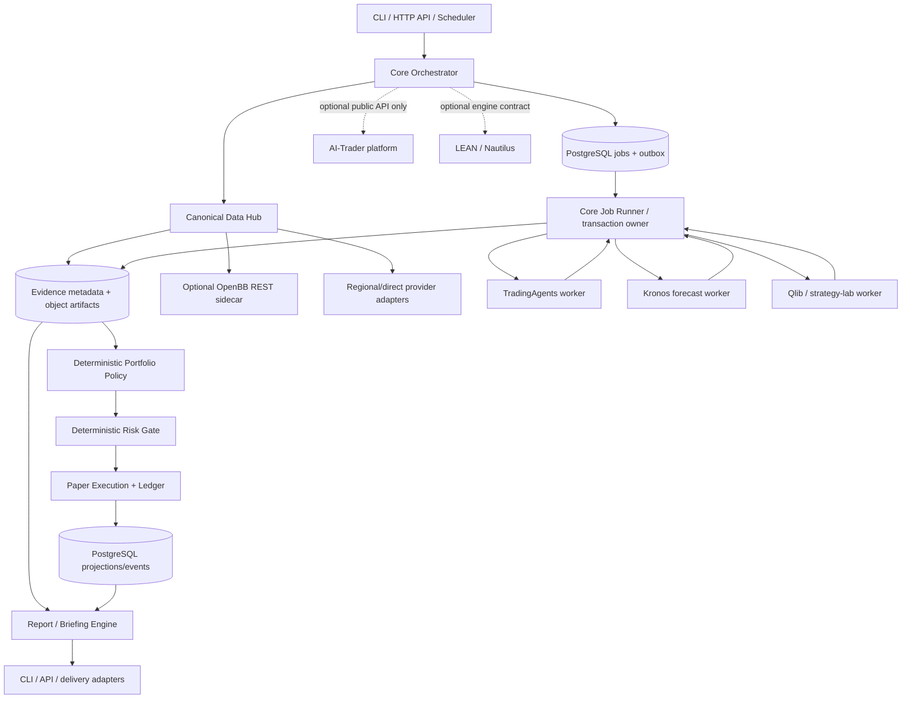
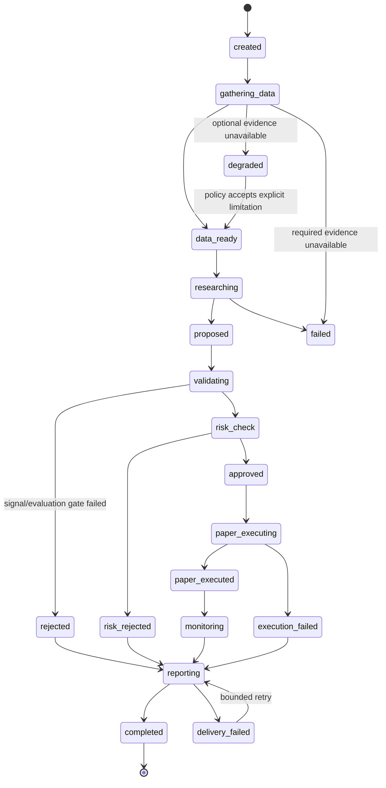

# Stonks Agent 整合架構藍圖

> 狀態：待一次性確認後進入實作  
> 研究基準：2026-07-10，對應 `docs/research/` 的五份研究文件與其中固定的 upstream snapshots  
> 文件目的：從目前只有研究文件的空專案，建立可重播、可稽核、預設只做 paper trading 的研究與交易代理平台

## 1. 目標產品

Stonks Agent 是一個 evidence-first 的投資研究、策略評估與模擬基金平台。它把多資料源、多種 LLM 研究流程、時間序列模型、傳統量化模型、報告與通知能力整合到同一套版本化 domain contracts，但不讓任何上游專案成為核心資料模型或唯一執行權威。

首個可發布產品應能完成下列閉環：

1. 依排程、CLI 或 API 建立研究 run，鎖定 instrument、`as_of`、horizon、資料與模型 policy。
2. 以 point-in-time 規則擷取行情、基本面、新聞、公告、macro 與其他 evidence，保存原始內容、時間語義、來源與 hash。
3. 執行 deterministic analyzers、TradingAgents research worker、ai-hedge-fund 衍生 alpha plugins 與可選 Kronos forecast worker。
4. 將所有結果正規化成 `ResearchArtifact`、`AnalysisBundle`、`AgentOpinion`、`ForecastSignal` 或 `AlphaSignal`；LLM 文字只能成為有引用的 evidence/thesis/opinion。
5. 由 deterministic portfolio policy 合成 target，再經 deterministic risk policy veto、clamp 或核准。
6. 只送往內建 paper broker 或隔離的模擬/backtest engine；寫入 orders、fills、positions、cash、fees 與 append-only ledger。
7. 產生結構化 `AnalysisReport`，再投影為 CLI、API、Markdown、Email 或 chat channel briefing。
8. 追蹤 realized outcome、benchmark alpha、drawdown、成本、模型與 provider 品質，供 replay、reflection 與策略升級門檻使用。

主要使用面為 CLI 與 versioned HTTP API。Web UI、MCP、chat delivery 都是可替換 adapters，不是核心成立條件。

### 產品安全模式

- `execution_mode=paper` 是程式預設、部署預設與測試預設。
- 第一版不提供可載入真實 broker credentials 的 live adapter，也不接受以設定字串把 paper adapter 切成 live。
- Research/LLM workers 沒有 execution credentials、portfolio mutation port 或資料庫寫入權；只能回傳 typed artifacts。
- Forecast 與 LLM 結果預設權重可為零，只有通過版本化 evaluation gate 的 strategy/model 才能參與 paper target。

## 2. 明確非目標

- 不保證獲利，不把作者 benchmark、stars 或上游 README 宣稱視為可交易性證據。
- 不在本藍圖內做 real-money trading、margin、short locate、options exercise 或 broker reconciliation。
- 不把七個指定 repository 複製到同一 source tree、同一 Python environment 或同一 runtime process。
- 不讓 LLM、agent debate、community vote、Kronos 預測或單一 upstream 直接建立 order。
- 不把 Markdown、DataFrame、LangGraph state、OpenBB `OBBject` 或 AI-Trader DB row 當跨元件 wire contract。
- 不把即時取得的新聞、社群資料混入歷史回測；無法證明當時可得的 evidence 一律不得進 point-in-time evaluation。
- 不執行 RD-Agent 或其他 LLM 產生的程式碼於核心/API process。
- 不建立包含 PyTorch、OpenBB、LangGraph、Qlib、Rust/C# engine 與所有 providers 的巨型 lockfile。
- 不在授權不清時複製 Dexter 或 AI-Trader 的 source、prompt、skills、assets、frontend 或 server 實作。
- 不宣稱 process/network boundary 自動解除 AGPL、LGPL 或 GPL 義務；授權判定仍是發布前 gate。
- 不在第一版重做完整券商級撮合、稅務、公司行動或跨幣別會計；未支援的語義 fail closed。

## 3. 架構原則

1. **Typed ports/adapters**：domain 與 application 只依賴自有 dataclass/Pydantic models 與 `Protocol` ports；provider、LLM、worker、storage、queue、renderer 都是 adapters。
2. **Evidence before opinion**：每個 claim、signal、report conclusion 都必須能回指 immutable evidence 與其 `as_of`、`published_at`、來源和 hash。
3. **Point-in-time by construction**：查詢必須帶 `as_of`; store 保存 `event_time`、`published_at`、`available_at`、`observed_at`，禁止只靠一個含糊 `date`。
4. **Deterministic control plane**：portfolio、risk、execution、accounting、idempotency 與 state transitions 不由 LLM 決定。LLM/Kronos等stochastic inference的原始輸出先封存為immutable artifact；重播從封存artifact開始，保證後續control plane一致，不要求fresh re-inference bit-identical。
5. **One orchestration authority**：核心 workflow store 是唯一平台狀態真相；LangGraph checkpoint、worker memory 與外部平台 heartbeat 只是 adapter-local state。
6. **Process isolation over dependency compromise**：重型、衝突或不同授權的 upstream 各自使用獨立 `uv.lock`/container/image；跨程序只交換 versioned JSON。
7. **Fail closed at high-risk boundaries**：資料缺失、stale、schema drift、模型 invalid output、風控狀態不明、重複 execution 或 ledger mismatch 都不能被轉成 empty success。
8. **Append-only and replayable**：run、risk、order、fill、report 與 delivery 以事件記錄，mutable projection 可重建且不能取代 audit log。
9. **Idempotent side effects**：每個 job、external request、order、publication 與 delivery 都有 caller-generated idempotency key、outbox 與 receipt。
10. **Paper-only capability security**：不只是 UI 隱藏；core 的 execution port allowlist、部署 manifest 與 policy schema 都拒絕 `live`。
11. **Small reversible increments**：先做 fake/replay adapters 與單一 instrument vertical slice，再增加 providers、workers 與 markets。
12. **One confirmation, continuous delivery**：本藍圖與 `tasks/todo.md` 經一次確認後，各 phase 依 automated quality gate 連續推進，不在每個 phase 重新要求確認；若未來擴張到 live trading、改變產品授權或引入新外部權限，必須另立 RFC。

Canonical decision flow固定為：

```text
EvidencePack / ResearchArtifact
  -> AnalysisBundle / AgentOpinion / AlphaSignal / ForecastSignal
  -> deterministic PortfolioTarget
  -> deterministic RiskDecision
  -> OrderIntent
  -> ExecutionReceipt / Fill / LedgerEntry
```

`AgentOpinion` 不是 order，也不能直接跳到 `RiskDecision`。若要讓 opinion 影響 target，必須經版本化、已評估的 mapper 轉成 `AlphaSignal`；AI-Trader 僅位於這條 canonical flow 之外的 external control/community integration。

## 4. Repository 與 dependency topology

主 repository 採 Python 3.12、`uv` workspace。核心 package 不直接依賴任何重型 upstream。

```text
stonks-agent/
├─ pyproject.toml                 # uv workspace、core dev tools
├─ uv.lock                        # 只鎖 core/contracts/CLI/API
├─ src/stonks_agent/
│  ├─ domain/                     # entities、value objects、policies、invariants
│  ├─ application/                # use cases、workflow handlers
│  ├─ ports/                      # typed Protocol ports
│  ├─ adapters/                   # core-safe DB、HTTP、LLM、provider、delivery adapters
│  ├─ entrypoints/                # CLI、FastAPI、worker runner
│  └─ config/                     # validated settings、policy manifests
├─ packages/contracts/            # 輕量 Pydantic package + exported JSON Schema
├─ workers/
│  ├─ tradingagents/              # Apache-2.0 upstream isolated env
│  ├─ kronos/                     # MIT code/model isolated PyTorch env
│  ├─ quant_lab/                  # Qlib；RD-Agent 另在 Linux sandbox profile
│  └─ reporting/                  # 只有必要時才拆出的 render/delivery worker
├─ sidecars/
│  ├─ openbb/                     # optional AGPL service manifest、source offer/notice
│  ├─ lean/                       # optional Apache-2.0 backtest sidecar
│  └─ nautilus/                   # optional LGPL runtime adapter
├─ schemas/                       # 由 contracts export 的 versioned JSON Schema
├─ migrations/                    # PostgreSQL Alembic migrations
├─ templates/                     # 自有或具清楚 notice 的 report templates
├─ infra/                         # compose、container、observability、deployment manifests
├─ tests/                         # unit/contract/integration/e2e/replay/security
├─ docs/                          # architecture、research、runbooks、ADR、third-party notices
└─ tasks/                         # todo、lessons
```

每個 `workers/*` 與 `sidecars/*` 都有自己的 manifest、lockfile、image、health endpoint、SBOM 與版本記錄。核心 `uv.lock` 不吸收它們的 dependencies。

### Platform support matrix

| Surface | Windows 11 | Linux x86_64 | Linux + NVIDIA GPU |
|---|---|---|---|
| Core開發、CLI、unit/contract/fake-replay E2E | 支援，CI必測UTF-8/path差異 | 支援，CI與正式基準 | 支援但不需要GPU |
| PostgreSQL integration / local Compose | Docker Desktop或外部PostgreSQL | 支援 | 支援 |
| TradingAgents worker | 開發smoke可支援；正式不承諾 | 正式OCI target | 同Linux |
| Kronos worker | CPU開發smoke；GPU不承諾 | CPU OCI target | 正式CUDA OCI target |
| OpenBB、Qlib、LEAN、Nautilus sidecars | 透過Docker Desktop作開發smoke | 正式OCI target | 依upstream能力 |
| RD-Agent sandbox | 不支援native Windows | 唯一正式target | 可選 |

正式部署唯一承諾是Linux OCI images；Windows只承諾core開發與CI，以及透過Docker Desktop執行可用的sidecar smoke。所有文字、fixture與subprocess tests固定UTF-8，避免CP950回歸。

## 5. Components 與 process boundaries



| Process | Runtime / deployment | 責任 | 明確禁止 |
|---|---|---|---|
| `stonks-api` | Python 3.12 core `uv.lock` | Auth、request validation、run/query API、CLI-compatible use cases | 長時間 LLM/ML、provider SDK global state、order fill simulation |
| `stonks-worker` | 同 core package，可獨立 scale | 持有job lease；驗證remote result；在單一DB transaction寫artifact metadata/domain event/outbox並ack | 任意 upstream imports、把DB/event transaction ownership交給remote worker |
| `tradingagents-worker` | 固定 Apache-2.0 snapshot 的獨立 Python image | `AnalysisRequest -> AnalysisBundle/AgentOpinion`，只讀core允許的canonical evidence | Broker、portfolio DB、secrets、直接寫 evidence store；paper/backtest/prod profile禁止任意market/web egress |
| `kronos-worker` | 獨立 PyTorch image；CPU/CUDA profile | `ForecastRequest -> ForecastSignal`、model cache、warm-up、output validation | 直接變成 OrderIntent、網路任意下載未 pin 權重 |
| `quant-lab-worker` | Qlib image；RD-Agent 僅 Linux sandbox profile | Dataset/feature/model/backtest evaluation、candidate artifact | 自動 promote、核心 DB credentials、production execution |
| `openbb-sidecar` | Optional、最小 provider allowlist、獨立 AGPL image | OpenBB REST/MCP read-only data access | 成為 canonical store、自動 provider fallback、與 permissive core 併碼 |
| `paper-executor` | 第一版可與 core worker 同 env、獨立 service account | 驗證過的 command、deterministic fills、ledger/account projections | 接收 LLM output、live broker credentials、fail-open retry |
| `reporting/delivery` | core adapter；容量需要時拆 worker | Structured report、render、chunk、retry、receipt | 從 Markdown 反解析 domain state |
| `AI-Trader adapter` | Core typed HTTP client，連往外部平台 | 發布去敏 thesis、challenge/experiment、discussion 與 community feedback events | 作為 in-process research worker、paper executor或canonical ledger；import/vendor upstream server/frontend |

跨程序 contract 以 JSON Schema/OpenAPI 固定；所有 request 都包含 `schema_version`、`request_id`、`run_id`、deadline、idempotency key、`attempt_generation`與不可猜測的`attempt_nonce`。Remote worker不共用資料庫schema/credentials，只回傳typed result或上傳至scoped artifact URL；core job runner驗證generation/nonce後，才在單一DB transaction持久化result、domain event/outbox並ack。Lease已失效或generation較舊的late result一律拒絕/隔離，不能覆寫新attempt。系統不接受pickle、任意Python object或upstream internal types。

## 6. Canonical domain contracts

### 6.1 共通 envelope 與時間語義

所有跨程序 objects 均為 frozen Pydantic models，預設 `extra='forbid'`。金額與數量使用 `Decimal` 字串序列化；時間使用 timezone-aware UTC RFC 3339；market session 另保存 exchange timezone。

```text
ContractEnvelope
  schema_name, schema_version
  object_id, run_id?, causation_id?, correlation_id?
  created_at, producer, producer_version
  payload_hash, idempotency_key?
```

| 欄位 | 語義 |
|---|---|
| `event_time` | 市場或企業事件實際發生時間 |
| `published_at` | 來源正式發布時間 |
| `available_at` | 資料在指定 provider 對使用者可取得的最早時間 |
| `observed_at` | 本系統抓取或看到資料的時間 |
| `as_of` | 本次決策允許使用 evidence 的截止時間 |
| `effective_from/to` | instrument、policy、模型或 mapping 生效區間 |

任何 evidence 要進入 run，必須滿足 `available_at <= run.as_of`。若無法證明 `available_at`，quality 必須為 `estimated/unknown`，且預設不得用於嚴格 backtest。

### 6.2 API envelope 與 boundary errors

所有CLI/API/worker boundaries先做schema、size、range、enum、identifier、time與authorization validation。成功與失敗都使用一致envelope，不把stack trace、provider secret或untyped exception暴露給caller：

```json
{
  "success": true,
  "status": "ok",
  "data": {},
  "error": null,
  "metadata": null
}
```

```json
{
  "success": false,
  "status": "validation_error",
  "data": null,
  "error": {
    "code": "INVALID_AS_OF",
    "message": "Request validation failed",
    "details": [],
    "request_id": "...",
    "retryable": false
  },
  "metadata": null
}
```

- 分頁response在`metadata`加入`cursor/next_cursor/limit/has_more/total?`；不把pagination混進domain `data`。
- Domain/Application回傳structured error union；adapter只在boundary把外部exception轉成stable error code一次。
- Infra failure、timeout、quota、empty、not-supported、stale與validation error各有不同status/code，不得吞掉或偽裝成功。
- HTTP status與envelope `status`一致；idempotency conflict、optimistic concurrency與late worker result使用可機器判讀的錯誤碼。
- External response也先經typed tolerant-reader validation，再進domain；保留未知provider欄位於versioned `extensions`，不污染主schema。

### 6.3 Instrument 與 market data

`InstrumentKey`

- `instrument_id`：不可變內部 UUID，不以 ticker 當主鍵。
- `asset_class`、`primary_symbol`、`exchange_mic`、`currency`、`timezone`。
- `provider_symbols`、`valid_from/to`、corporate-action identity history。

`MarketDataQuery`

- `instrument_ids`、capability、interval、start/end、`as_of`、adjustment、session。
- provider policy ID、freshness requirement、strict point-in-time flag。

`MarketDatum` / `BarSeries`

- Instrument、interval、adjustment、session 與 OHLCV/amount/vwap values。
- `event_time/published_at/available_at/observed_at/as_of`。
- provider、endpoint、request ID、raw artifact ref、payload hash。
- `DataQuality`：`available/missing/not_supported/fallback/stale/estimated/partial/fetch_failed/conflict`，以及 completeness、warnings、fallback chain。
- Invariants：finite values、`low <= open/close <= high`、non-negative volume、timestamps strictly increasing、無 duplicate bars。

`DatasetSnapshot`

- Immutable manifest：instrument universe、calendar、query/spec、每個 artifact hash、provider versions、corporate actions、snapshot cutoff、schema version。
- 研究、forecast、backtest 只收 snapshot ID，不自行抓 live data。

### 6.4 Evidence 與研究

`EvidenceItem`

- `evidence_id`、subject、kind、claim-neutral payload。
- 所有時間欄位、source/provider/URL、content hash、raw artifact ref。
- quality、sensitivity、license/redistribution tag、expiry。
- `derived_from[]` 與 transformation version，形成 provenance DAG。

`EvidencePack`

- `pack_id`、run/as-of、ordered blocks、required/missing capabilities、quality summary。
- 只引用 immutable `EvidenceItem`，不複製未受控 display text。

`ResearchRequest` / `ResearchArtifact`

- Request：question、instrument、as-of、horizon、allowed evidence IDs、tool/model policy、budget、deadline。
- Artifact：typed claims、citations、counterarguments、risks、confidence、warnings、model/tool versions、token/cost/latency。
- 每個 claim 至少一個 evidence ref；無引用的內容標為 `hypothesis`，不得轉成 deterministic feature。
- 外部 web、filing、community 文字一律標 `untrusted_content`；不能直接插入 system/tool instructions。

`AnalysisBundle` / `AgentOpinion`

- Bundle 保存各 analyst reports、debate transcripts、research plan、opinion IDs、source refs、model usage、warnings與worker version。
- Opinion 保存 instrument、as-of、horizon、rating/recommendation、thesis、confidence、evidence refs與producer/model versions。
- Confidence 明示 `uncalibrated/calibrated`；未通過獨立 outcome evaluation時只可展示，不得作為position sizing數值。
- TradingAgents只回傳這兩種contract；其Trader/Portfolio Manager/risk debate輸出皆屬 opinion，不能命名或解讀為trade/order intent。
- `OpinionToAlphaPolicy` 是獨立、deterministic、版本化且需evaluation的application policy；沒有這個promotion path時，opinion不影響portfolio target。

### 6.5 Forecast 與 alpha

`ForecastSignal`

- instrument、as-of、interval、horizon bars。
- expected/median return、direction probability、expected volatility、downside/max-drawdown quantiles。
- path count、dispersion、calibration bucket、input quality。
- model/tokenizer ID + exact revision/hash、device、seed policy、inference code version。
- dataset snapshot、input window、generated time、latency、validity warnings。

`AlphaSignal`

- strategy/model ID + semantic version、instrument、as-of、horizon。
- value `[-1, 1]`、confidence `[0, 1]`、expiry、direction/target semantics。
- evidence refs、forecast refs、evaluation report ID、reason codes。
- Signal 不是 order；stale、未校準或未 promote 的 signal 不參與 target。

`StrategyManifest` / `EvaluationReport`

- Strategy source/artifact hash、runtime image、features/labels、universe、cost model、split policy、parameters與 owner。
- Evaluation 保存 baseline、walk-forward/CPCV 結果、turnover、fees/slippage sensitivity、drawdown、calibration、leakage/survivorship checks、reproducibility hash。
- Promotion state：`draft -> evaluating -> rejected | shadow -> paper_eligible -> retired`；沒有自動 live state。

### 6.6 Portfolio、risk 與 execution

`PortfolioSnapshot`

- account、cash、NAV、positions、pending orders、prices、FX rates、as-of、ledger sequence/hash。

`PortfolioTarget`

- target weights/quantities、current-to-target delta、constraints、optimizer/policy version。
- input signal/evidence/snapshot IDs、expected turnover/cost、calculation hash。
- `Overweight/Underweight` 必須先結合現有 position 算 delta，禁止硬映射為 buy/sell。

`RiskDecision`

- approved/rejected、normalized/clamped target、reasons、limits snapshot、policy version/hash、expires-at。
- 含 data freshness、signal eligibility、cash、single-position、sector、gross/net exposure、turnover、liquidity、order size、drawdown 與 kill-switch checks。
- Risk 可 veto；LLM/community/administrator不能直接 override。例外只能透過版本化 policy change 產生新決策。

`AccountReservation`

- Approved risk decision不單獨代表資金可用。Core必須在per-account serialized aggregate/advisory lock內重新確認ledger sequence，並原子建立cash或sellable-position reservation與`OrderIntent`。
- Reservation含account、asset/currency、amount/quantity、risk decision、portfolio sequence、order intent、expiry與state；fill/cancel/reject/expire以事件consume/release。
- 所有open reservations都納入後續available cash/position與risk計算，避免多個並行runs雙花或超賣。

`OrderIntent` / `ExecutionCommand`

- Intent 是經 risk 核准後的 domain request；Command 是 executor-ready immutable payload。
- instrument、account、side、type、qty/notional、limit/stop、time-in-force、validity window。
- `risk_decision_id`、`reservation_id`、portfolio snapshot/aggregate sequence、idempotency key、execution-model version。

`OrderEvent` / `Fill` / `ExecutionReceipt`

- 狀態、timestamps、filled/remaining qty、price、fees、slippage、external/simulator refs。
- 每個事件帶 monotonic sequence、previous-event hash；未知或重複狀態不可靜默覆寫。

`JournalTransaction` / `JournalPosting`

- Canonical ledger是明確的balanced double-entry journal，不是單一mutable balance或「類double-entry」。
- 每筆transaction至少兩個postings；經Decimal quantization後，每種currency/commodity的debit/credit都必須sum to zero，使用明確cash、inventory、fee、PnL與clearing accounts。
- Journal sequence、transaction hash、previous hash與source fill/order不可變；cash/position/NAV/P&L只是可重建projections。

### 6.7 Workflow、report 與 delivery

`Run` / `RunEvent`

- Run 保存 request、state、policy/config snapshot refs、deadline、attempt、owner。
- Event 保存 sequence、type、payload ref/hash、causation、producer；run projection可由 events 重建。

`AnalysisReport`

- subject/as-of/language/type、conclusion、score/confidence、risks/catalysts/scenarios。
- signal attribution、action guardrails、data limitations、evidence refs。
- generator/model/prompt/policy versions；renderings 只存 template version/content hash/ref。

`DeliveryRequest` / `DeliveryReceipt`

- channel、recipient ref、content ref、chunking policy、idempotency key、attempt/deadline。
- receipt 保存 accepted/delivered/failed、provider message ID、redacted error。

## 7. Typed ports 與首選 adapters

| Port | 核心操作 | 第一個 adapter | 後續 adapters |
|---|---|---|---|
| `InstrumentRepository` | resolve/history/upsert mapping | PostgreSQL | Reference-data service |
| `MarketDataPort` | fetch/quote/history/corporate actions | Replay/Fake + direct regional adapter | OpenBB REST、paid providers |
| `ProviderPolicyPort` | rank/health/quota/freshness | YAML policy + PostgreSQL health | Dynamic policy service |
| `ArtifactStorePort` | put/get immutable bytes by hash | Local filesystem | S3-compatible object store |
| `EvidenceRepository` | append/query provenance DAG | PostgreSQL metadata | Analytical replica |
| `ResearchWorkerPort` | analyze -> `AnalysisBundle/AgentOpinion` | Deterministic stub | TradingAgents worker、clean-room agent tools |
| `ForecastPort` | forecast typed snapshot | Deterministic baseline | Kronos worker |
| `StrategyLabPort` | evaluate/promote candidate | Local evaluator | Qlib、sandboxed RD-Agent、LEAN/Nautilus |
| `LLMPort` | structured generation with budget | Fake cassette | OpenAI-compatible/Anthropic adapters |
| `PortfolioPolicyPort` | signals + snapshot -> target | Versioned deterministic policy | Optimizer strategies |
| `RiskPolicyPort` | target + state -> decision | Deterministic rule set | Additional compliance rules |
| `ExecutionPort` | submit/status/cancel idempotently | Paper broker | Optional simulation engines only |
| `LedgerPort` | append/replay/project | PostgreSQL event ledger | Immutable archive |
| `WorkflowStorePort` | claim/transition/retry | PostgreSQL | None until scale proves need |
| `QueuePort` | enqueue/lease/ack/dead-letter | PostgreSQL jobs | Redis/NATS adapter |
| `ReportPort` | generate/validate/render | Pydantic + Jinja2 | Dedicated reporting worker |
| `DeliveryPort` | send/status | Console/file | Email/chat/webhooks |
| `PlatformPort` | publish/poll community events | Fake | AI-Trader public HTTP API |
| `Clock` / `IdGenerator` | deterministic time/IDs | System | Frozen test clock/deterministic IDs |
| `SecretProvider` | named secret lookup | Env in local dev | Cloud secret manager |

Port methods回傳 typed success 或 structured error union；infra exception 只能在 adapter boundary 轉換一次，不得變成空 list、空 DataFrame 或 generic `None`。

## 8. Workflow 與 state machines

### 8.1 Daily/research-to-paper workflow



共同規則：

- Transition 以 `expected_state + run_version` compare-and-swap，避免多 worker 重複執行。
- 每個 step 有獨立 idempotency key、timeout、retry class 與 dead-letter policy。
- Data/research/report 可以 bounded retry；execution retry 先以 idempotency key 查詢既有 receipt。
- `cancelled` 可從尚未執行 paper order 的任何狀態進入；已有 fill 時只能停止後續 order並正常結算/報告。
- Optional evidence failure 可進 `degraded`，但報告必須顯示；required data、risk或ledger failure直接 fail closed。

### 8.2 Strategy promotion workflow

```text
draft
  -> static_checks
  -> reproducibility_check
  -> leakage_and_point_in_time_audit
  -> walk_forward_and_cost_evaluation
  -> rejected | shadow
  -> paper_eligible
  -> suspended | retired
```

- RD-Agent 只可產生 `draft` artifact；不能自行變更 registry state。
- `shadow` 會產生 signals/targets但不建立 orders。
- `paper_eligible` 需 evaluation policy 全部通過，且綁定 exact strategy/data/runtime hashes。
- Drift、replay mismatch、risk breach、dependency/license問題可自動 suspend。

### 8.3 Community feedback workflow

AI-Trader 或其他 external community/control platform只接收已去敏的 thesis projection。回覆在固定 deadline 內轉成帶 author/time/reputation/source 的 `ExternalEvidence`；未信任原文不直接成為 prompt instruction。Policy 只能選擇重跑 research、調低 confidence 或忽略，不能繞過 signal promotion/risk gate。AI-Trader的remote paper/copy positions只可作外部觀測資料，本系統不透過該adapter提交canonical orders，也不以其ledger取代本地paper ledger。

## 9. Storage、queue 與 consistency

### PostgreSQL：canonical transactional state

預計資料域：

- `instrument`、`instrument_alias`、`trading_calendar_version`。
- `artifact_manifest`、`evidence_item`、`evidence_edge`、`dataset_snapshot`。
- `strategy`、`strategy_version`、`evaluation_report`、`signal`。
- `run`、`run_event`、`workflow_job`、`dead_letter_job`。
- `portfolio_account`、`account_reservation`、`position_projection`、`cash_projection`。
- `risk_decision`、`order_intent`、`order_event`、`fill`、`journal_transaction`、`journal_posting`。
- `analysis_report`、`rendering`、`delivery_receipt`。
- `outbox`、`inbox_dedup`、`provider_health`、`usage_budget`。

Domain event、journal transaction/posting、evidence與已簽發risk decision禁止update/delete；修正以新事件或superseding version表示。Mutable projection要保存來源event/journal sequence，replay後hash必須一致。每筆journal transaction在commit前驗證每種currency/commodity debits=credits；不平衡transaction整筆rollback並啟動paper kill switch。

### Object/artifact store

- Raw provider response、filing/news body、dataset parquet、model output、report rendering、evaluation bundle 以 SHA-256 content address 儲存。
- Local 開發使用 repository 外的 `.data/artifacts/`；正式環境使用 versioned S3-compatible bucket。
- DB 只存 metadata、hash、size、media type、encryption/retention、source license tag與 object ref。
- Artifact 完成上傳並驗 hash 後才可被 event 引用；孤兒 object 由保守 GC policy 清理。

### Queue/outbox

- 第一版使用 PostgreSQL durable jobs + `FOR UPDATE SKIP LOCKED` lease，減少必需基礎設施並保證 workflow/outbox transaction一致。
- Job 包含 type、payload ref、idempotency key、priority、not-before、deadline、attempt/max-attempt、lease owner/expiry、monotonic lease generation與attempt nonce。
- Core job runner是唯一transaction owner：持有lease後呼叫remote worker；驗證contract、generation、nonce與artifact hash，再以同一transaction寫result metadata/domain event/outbox並ack。Remote worker永不直接寫DB/event/outbox。
- Lease失效、nonce錯誤或舊generation的late result進隔離audit，不得commit；core runner crash後重領也不產生重複side effect。
- 規模證明需要時才以 `QueuePort` 增加 Redis/NATS adapter，不能改 domain semantics。
- LLM/forecast/quant jobs 使用獨立 queues、concurrency、rate/cost budgets，避免重型 worker 阻塞 risk/execution。

### Cache

- Cache key 必須包含 provider、endpoint、normalized query、as-of、adjustment、schema與adapter version。
- Cache 是可重建 optimization，不是 provenance store；回應仍指向原始 artifact。
- Stale-while-revalidate 只在 capability policy允許時使用，且 quality 明示 `stale`。

## 10. Data/provider policy

顯式 provider state machine：

```text
candidate
  -> config_missing/not_supported: skip + record
  -> request_error/quota: record + circuit breaker
  -> empty: classify legitimate_empty or provider_failure
  -> stale/partial: accept only by capability policy
  -> normalized: invariant and reconciliation checks
  -> valid: persist raw + canonical + provenance
  -> all_failed: structured DataUnavailable
```

- 每個 market/capability 有獨立 allowlist、fallback order、freshness與成本 budget。
- OpenBB 每次只呼叫指定 provider；跨 provider fallback由本系統執行。
- A/H/TW 特有資料使用 regional adapters；不能把 suffix mapping 當完整市場支援。
- 高風險價格、corporate action、financial filing date 可要求雙來源 reconciliation；差異超門檻標 `conflict`，不讓 LLM猜測。
- Provider ToS、entitlement與redistribution tag 隨 evidence 保存；報告/外部平台 publication 先經 redistribution policy。
- Golden datasets包含多市場、休市、DST、拆股、股利、symbol change、stale/partial/conflict案例。

## 11. Deterministic portfolio、risk 與 paper execution

### Portfolio baseline

第一個 policy 是可解釋、版本化的 deterministic baseline：

1. 只讀 `paper_eligible`、未過期且 evaluation-compatible 的 signals。
2. 依策略 manifest 的固定 ensemble weight與confidence calibration合成 instrument score；missing signal不重新正規化成過度曝險。
3. 對 score 做 deadband、shrinkage、turnover penalty與最大 target bound。
4. 以現有 positions/cash算 delta，輸出 target、成本估計、constraint diagnostics。
5. 所有 Decimal rounding、tie-break與instrument ordering固定，輸出 calculation hash。

日後可新增 optimizer strategy，但相同 inputs/config 必須重播一致，且 optimizer內部型別不得進 wire contract。

### Hard risk gate

至少檢查：

- Dataset/evidence freshness、conflict、signal eligibility/expiry、model drift/suspension。
- Paper account狀態、cash、pending orders、position/NAV與ledger sequence一致。
- Available cash/sellable position扣除所有open reservations；risk approval到OrderIntent建立在per-account serialized transaction內，避免concurrent runs雙花/超賣。
- Max single-name/sector/asset-class/gross/net exposure、order notional、daily turnover。
- Liquidity/ADV participation、price band、market calendar/session、unsupported asset/order semantics。
- Portfolio drawdown、daily loss、consecutive execution errors、provider outage與global kill switch。
- Risk decision/reservation expiry；execution時若account aggregate sequence或reservation狀態已變，拒絕並重新評估而非沿用舊決策。

### Reference paper broker

- 只消費 immutable `ExecutionCommand`；market/limit order語義與 fill timing明確版本化。
- 預設用 command之後第一個可交易 bar，不可用同一根已知 close 回填。缺 future bar則保持 pending或expire，不製造 fill。
- Fees、slippage、spread、volume participation與partial fill model均為 explicit config；沒有設定時不能宣稱 realistic。
- 同一 idempotency key永遠回同一 receipt；取消、拒絕、部分成交以事件表示。
- 每個accepted command必須帶有效reservation；fill/cancel/reject/expire原子consume/release，executor按account序列化mutation。
- Cash、inventory、fees與realized/unrealized P&L由balanced double-entry journal推導；每種currency/commodity的postings必須平衡，否則整筆rollback與kill switch。每日做journal replay/reconciliation。
- 可透過相同 `ExecutionPort` 接 LEAN/Nautilus模擬 adapter，但其 engine version、calendar、fees與fills完整寫回 canonical events。

## 12. Security 與 authorization boundary

Security不是P6才補的功能。P0 vertical slice即實作external-input validation、統一API error envelope、local principal + permission checks、service capability separation、secret redaction、paper-only schema、tool/egress deny與security tests；P6只把既有ports換成production OIDC/secret manager/rate-limit exporters並加深攻擊測試。

### Identity / authorization

- Local CLI 可使用單一 local principal；HTTP deployment使用 OIDC/OAuth2，由成熟 IdP簽發短效 token。
- RBAC 最少分 `viewer`、`researcher`、`strategy_reviewer`、`paper_operator`、`admin`；service account各自最小權限。
- Research/forecast workers只可取得 scoped artifact URLs與回傳結果，不能讀 portfolio tables、secrets或execution endpoints。
- Paper executor只接受core簽發、未過期且risk-approved的 command；不能接受一般 user/agent request body。
- AI-Trader remote token、LLM keys、provider keys均分開保存與輪替，不信任上游明文token/password設計。

### Untrusted content / tool policy

- Web、news、filing、community、MCP與LLM output皆視為 untrusted data；prompt中以資料區塊隔離，不允許其改變system/tool policy。
- Tool registry採 allowlist、typed arguments、instrument scope、timeout、output byte limit、redaction、audit與bounded concurrency。
- Research tool不能取得 filesystem write、shell、secret、queue mutation或execution tool。
- RD-Agent/generated code只在無核心credentials、read-only dataset、限制CPU/RAM/time/network的ephemeral Linux sandbox執行；產物先靜態掃描與重跑evaluation。

### Secrets / supply chain / API

- Secrets不進 config files、logs、events、snapshots、report或container layers；local只透過未版控env，正式用secret manager。
- 所有外部輸入使用Pydantic `extra=forbid`、size/range/enum validation；DB用參數化查詢，renderer預設escape。
- Browser cookie auth才啟用CSRF；所有API做authn/authz、rate limit、request body limit與structured error redaction。
- Dependencies pin版本/hash；CI產生SBOM、license inventory、vulnerability scan與container signature。
- Egress按process allowlist；OpenBB/provider/LLM/AI-Trader endpoint不得由request任意指定，防SSRF。
- Artifact encryption、retention、deletion與敏感度policy明示；audit events不保存prompt中的秘密或個資原文。

## 13. Observability、audit 與 reliability

Reliability也從P0開始：fake/replay slice必須具trace context、structured logs、in-memory metrics、idempotency、inbox/outbox語義、lease generation/nonce fencing、balanced journal replay與crash/duplicate tests。P1將其落到PostgreSQL；P6只補production exporters、dashboards、alerts、restore與large-scale fault drills。

- 全系統使用 OpenTelemetry traces、structured JSON logs與Prometheus-compatible metrics；關聯鍵為 `run_id/request_id/job_id/evidence_id/order_id`。
- Metrics至少涵蓋provider latency/error/empty/stale/conflict、queue lag/retry/dead letter、worker saturation、LLM tokens/cost、model latency/device、signal eligibility、risk rejects、paper fill/reconciliation、delivery failure。
- 每個run有usage budget：provider calls、LLM tokens/cost、wall-clock deadline與worker concurrency；超限輸出structured degraded/failed state。
- Run events與ledger entries含sequence及previous hash，定期輸出tamper-evident checkpoint；projection replay hash mismatch為critical alert。
- Health分 liveness/readiness/dependency coverage；OpenBB extensions/providers、model revisions與worker contract versions在啟動時公布。
- Circuit breaker、bounded exponential backoff+jitter、dead-letter與manual replay都透過use case執行並留下audit。
- SLO先針對platform correctness而非報酬：零重複paper orders、零future-data leakage、100% report claim可追溯、100% risk decision可重播。

## 14. 授權與第三方邊界

這是工程政策，不是法律意見。發布、SaaS或商業化前仍需法律判定。每次更新 upstream 都要重新檢查 license、public API、dependency、model/data terms與migration notes。

### 分區政策

```text
自有 permissive core
  ├─ 自有 domain/contracts/workflow/risk/paper ledger
  ├─ MIT / Apache components（有notice且經dependency review）
  └─ external ports
       ├─ OpenBB AGPL sidecar（optional；exact source/patch流程）
       ├─ AI-Trader public API（no vendor/import）
       ├─ Dexter-inspired clean-room behavior（no source/prompt/assets）
       ├─ Nautilus LGPL runtime boundary
       └─ LEAN Apache / Freqtrade GPL isolated services
```

- `THIRD_PARTY_NOTICES.md`、machine-readable dependency/license inventory與各image source manifest是release artifacts。
- MIT/Apache code若直接移植，保留copyright/license/NOTICE並以來源commit標註。
- OpenBB process/network isolation是技術邊界，不保證不構成combined work；若修改或網路提供，必須準備對應source、patch、build recipe與AGPL §13流程。
- Provider資料授權獨立於OpenBB/adapter程式授權；無重散布權的raw data不得進外部briefing或AI-Trader publication。

## 15. Upstream adoption matrix

| Upstream / snapshot | 能力 | License狀態 | 採用決策 | Process/API邊界 | Phase / gate |
|---|---|---|---|---|---|
| ai-hedge-fund `3a18702c` | AlphaModel/Signal、PEAD、event study、baseline backtest | MIT | 以自有contract鏡射；選擇性移植PEAD/pure stats並保留notice。v1 persona改寫為alpha plugins；不採LLM portfolio/risk | Core-safe plugin或isolated research adapter；不引入其整個app | P2/P3；point-in-time與cost evaluation通過 |
| Dexter `bae66167` | Agent loop、tool registry、memory、cron、gateway UX | README稱MIT但無license text/file | 僅clean-room重做公開概念；不copy source/prompt/assets | 自有Python research orchestrator/tools；未來license明確才另評估sidecar | P2；`NO_VENDOR_DEXTER_CODE` CI gate |
| TradingAgents `01477f9a` / v0.3.1 | Analyst/debate/research graph、structured reports | Apache-2.0 | 固定版本直接使用public API，外包typed adapter；LLM risk只當artifact | 獨立worker，避免process-global config污染 | P2；contract、budget、PIT evidence tests |
| Kronos `67b630e6` + pinned HF revisions | OHLCV foundation-model forecast | MIT | Import於獨立worker；保留sample paths、calendar/quality/validity adapter | PyTorch worker，無execution權限 | P3；golden regression、walk-forward、calibration |
| daily_stock_analysis `aa513135` | Context quality vocabulary、report schema/templates、delivery/tool policy | MIT | 移植小型schema/template primitives或clean implementation；不import monolith | Core reporting adapters或獨立worker | P2；notice、golden rendering、evidence integrity |
| AI-Trader `d03ff6c0` | Agent platform、paper/copy、challenge/team/community API | 無LICENSE且server聲明proprietary | 只寫external control/community public HTTP adapter；不採其paper/copy execution、不import或clean-room重做server | Optional remote integration，tolerant typed client，位於canonical order flow之外 | P5；license/API/authz/idempotency risk accepted |
| OpenBB `1c748931` / published package重新pin | Global data routers/providers、REST/MCP | AGPL-3.0-only | Optional unmodified/minimally configured sidecar；核心不import/copy | REST為deterministic ingestion，MCP只給read-only agent discovery | P1；legal/release-source/provider-ToS gate |
| Microsoft Qlib `d5379c52` | Dataset、feature/model、portfolio research、backtest | MIT | 第一優先quant research backend | Isolated quant-lab worker | P3/P5；canonical snapshot converter與reproducibility |
| Microsoft RD-Agent `4f9ecb00` | Factor/model proposal/evolution | MIT、Linux-only | Optional strategy-lab generator；generated code永不自動promote | Ephemeral Linux sandbox/container | P5；sandbox、static scan、full reevaluation |
| NautilusTrader | Event-driven backtest/paper semantics | LGPL-3.0 | Optional mature simulation backend；不讓engine types滲入core | Isolated runtime adapter | P5；license、contract parity、replay |
| QuantConnect LEAN | Multi-asset backtest/execution breadth | Apache-2.0 | Optional C#/Docker backtest sidecar | Versioned job/result API | P5；calendar/cost/fill parity |
| FinRL | DRL experiments | MIT | Experimental benchmark only | Isolated model worker | Future；must beat baselines after costs |
| Freqtrade | Crypto dry-run/backtest/ops | GPL-3.0 | Crypto需求成立才作external service | Network/process boundary | Future；license與asset-scope RFC |
| vectorbt | Parameter sweeps | Apache-2.0 + Commons Clause | 預設不採用 | None | Legal/business restriction釐清後再議 |

## 16. 風險控制與停止條件

| 風險 | 控制 | 自動停止 / fail-closed條件 |
|---|---|---|
| Look-ahead、survivorship、publication lag | Immutable snapshot、available-at、historical universe、leakage tests | 任一 required evidence無法證明當時可得 |
| Provider錯誤、stale、schema drift | Contract tests、quality state、reconciliation、circuit breaker | Required capability全失敗、conflict超門檻、unknown schema |
| LLM hallucination / prompt injection | Citations、structured schema、untrusted-content isolation、tool allowlist | 無引用claim試圖轉signal、invalid schema超retry |
| Model overfit / drift | Baseline、walk-forward/CPCV、cost sensitivity、shadow、calibration monitoring | Evaluation未過、replay mismatch、drift breach |
| Duplicate/reordered jobs | Idempotency、lease、inbox/outbox、CAS transitions | 同key payload hash不同、state version conflict |
| Paper execution/accounting錯誤 | Risk sequence、ledger replay、daily reconciliation、kill switch | Cash/position/ledger不平、unknown order state |
| Dependency/license supply chain | Pin/hash/SBOM/notices/CVE/license gate | Critical CVE、license drift、missing corresponding source |
| Cost/latency runaway | Per-run budgets、queue isolation、deadline、model tiering | Budget/deadline exceeded；轉degraded/failed而非追單 |
| External platform/auth weakness | Typed client、scoped tokens、dedup、canonical local ledger | Authz anomaly、repeated event、remote schema incompatible |
| Generated code escape | Ephemeral sandbox、no secrets/egress、static/runtime tests | Sandbox policy violation或non-reproducible artifact |

Global kill switch會停止新paper commands與取消尚未成交的可取消orders，但不刪除ledger或隱藏既有fills。恢復需通過reconciliation與explicit audited use case。

## 17. Testing 與驗收策略

- **Unit**：domain invariants、policy、state transition、error mapping、rendering primitives。
- **Property-based**：Decimal/rounding、portfolio constraints、risk不變量、event replay、idempotency。
- **Contract**：Pydantic↔JSON Schema、core↔workers、provider cassettes、OpenBB/AI-Trader tolerant readers。
- **Point-in-time**：publication lag、timezone/DST、calendar、corporate action、historical universe、no-future-evidence property。
- **Integration**：PostgreSQL migrations/jobs/outbox/object store、worker crash/retry、provider outage、LLM invalid output。
- **Golden/regression**：canonical datasets、Kronos deterministic policy、PEAD/event study、reports、ledger projections。
- **E2E**：單一instrument與小型portfolio從schedule到data/research/risk/paper fill/report/replay。
- **Security**：authn/authz、prompt injection、tool scope、SSRF、secret redaction、dependency/container scans。
- **Resilience**：queue lease expiry、duplicate delivery、model/provider outage、DB restart、dead-letter replay、kill switch。

最終平台success criteria：

- 同一 dataset/config/runtime hashes可產生相同signals、risk decision、paper orders與ledger projection。
- 歷史run不能讀取 `available_at > as_of` 的 evidence。
- 每個report claim與signal都有可解析的provenance chain；所有data limitations會顯示。
- LLM/forecast/OpenBB/AI-Trader不可直接呼叫execution或變更portfolio。
- 重試、crash與duplicate messages不會造成重複paper order或delivery。
- Provider/model/LLM outage會降級或失敗，不會製造empty success或錯誤交易signal。
- Core在未啟動任何optional sidecar/worker時仍可用fake/replay adapters完成完整測試。
- Release artifacts含lockfiles、SBOM、third-party notices、schema/API版本與必要的對應source流程。

## 18. Delivery phases

實作的唯一細節清單在 `tasks/todo.md`；兩份文件使用相同phase編號：

| Phase | Outcome |
|---|---|
| P0 | Repository、contracts與完整in-memory fake/replay閉環：target、risk、reservation、next-session paper fill、balanced journal、report、replay，以及最小security/reliability gates |
| P1 | Canonical data/evidence、PostgreSQL/artifacts、provider policy、OpenBB optional sidecar |
| P2 | Research control plane、TradingAgents、ai-hedge-fund/DSA衍生能力、report/delivery |
| P3 | Signal/evaluation、Kronos、Qlib與strategy promotion |
| P4 | 將P0閉環升級為PostgreSQL-backed canonical portfolio/risk/reservation/paper execution/balanced journal與small-portfolio E2E |
| P5 | Optional ecosystems：AI-Trader、LEAN/Nautilus、RD-Agent與community/evaluation |
| P6 | 將P0起即存在的security/observability/reliability controls升級為production adapters、fault drills、deployment與release hardening |

確認本藍圖即代表可依P0→P6連續實作。每一phase的success criteria是技術gate，不是再次等待人工確認的pause point；只有超出本文件授權範圍的live trading、產品license變更或新外部高權限整合才需另行決策。
