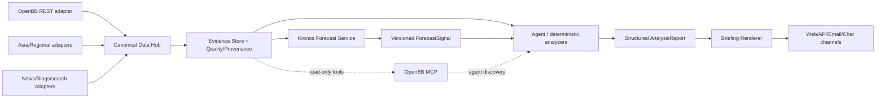

# 資料、預測模型與報告管線研究

> 研究日期：2026-07-10（Asia/Taipei）  
> 範圍：Kronos、daily_stock_analysis（以下簡稱 DSA）、OpenBB。本文只做研究與整合規劃，未實作整合程式碼。

## 結論先行

三案可以高度整合，但不應把任何一案整包併進主程式：

- **OpenBB** 適合作為「全球與跨資產資料 gateway」，不適合直接成為本系統的 domain model、儲存層或自動 failover 層。推薦以獨立 REST sidecar 為主、官方 MCP server 為 Agent 輔助入口，主程式仍保有自己的 canonical schema、快取、品質與 fallback 規則。
- **Kronos** 適合作為可插拔的 forecast signal engine，而不是交易決策器。先輸出帶模型版本、資料品質與不確定度的 signal artifact，再交由風控、組合與 Agent 使用。原生 `KronosPredictor` 會把多條 sampled paths 平均掉，若要可靠的不確定度，需要 adapter 保留分布或多次獨立推論。
- **DSA** 最值得吸收的是 `AnalysisContextPack`、結構化報告 schema、完整性檢查、Jinja 報告模板、通知渠道、資料品質詞彙與 tool policy；不建議直接 import 其 `StockAnalysisPipeline`、`GeminiAnalyzer` 或巨型 `NotificationService`。它們和全域設定、SQLite、資料抓取、搜尋及 UI 綁得太緊。
- **授權是硬邊界**：Kronos 與 DSA 為 MIT；OpenBB 全 repo 與套件 metadata 為 `AGPL-3.0-only`。獨立 process/HTTP 只提供技術隔離，並不自動保證主程式不受 AGPL 影響。若產品不是 AGPL 相容授權，應在採用前做正式授權判定，並避免複製或修改 OpenBB 原始碼。

建議的產品資料流：



## 研究快照

所有程式碼均以 shallow clone 的 `HEAD` 為準；後續研究應先比較 upstream diff，不能假設本報告永久有效。

| Repo | 本機快照 | Branch / commit | Commit 時間與訊息 | License |
|---|---|---|---|---|
| [shiyu-coder/Kronos](https://github.com/shiyu-coder/Kronos) | `.research/upstreams/Kronos` | `master` / [`67b630e67f6a18c9e9be918d9b4337c960db1e9a`](https://github.com/shiyu-coder/Kronos/tree/67b630e67f6a18c9e9be918d9b4337c960db1e9a) | 2026-04-13，batch dimension training fix merge | [MIT](https://github.com/shiyu-coder/Kronos/blob/67b630e67f6a18c9e9be918d9b4337c960db1e9a/LICENSE) |
| [ZhuLinsen/daily_stock_analysis](https://github.com/ZhuLinsen/daily_stock_analysis) | `.research/upstreams/daily_stock_analysis` | `main` / [`aa513135d67425d2484cdc9c643402c0f4c3ae07`](https://github.com/ZhuLinsen/daily_stock_analysis/tree/aa513135d67425d2484cdc9c643402c0f4c3ae07) | 2026-07-08，internal DSA tool surface | [MIT](https://github.com/ZhuLinsen/daily_stock_analysis/blob/aa513135d67425d2484cdc9c643402c0f4c3ae07/LICENSE) |
| [OpenBB-finance/OpenBB](https://github.com/OpenBB-finance/OpenBB) | `.research/upstreams/OpenBB` | `develop` / [`1c74893140292944e71ff5cdd9536edf12f05483`](https://github.com/OpenBB-finance/OpenBB/tree/1c74893140292944e71ff5cdd9536edf12f05483) | 2026-07-08，provider docstring fix | [AGPL-3.0-only](https://github.com/OpenBB-finance/OpenBB/blob/1c74893140292944e71ff5cdd9536edf12f05483/LICENSE) |

2026-07-10 的活躍度快照：

| Repo | 近期狀態 | 判讀 |
|---|---|---|
| Kronos | 約 32k stars；最新 commit 2026-04-13；76 commits；沒有 GitHub Release | 熱度高但工程發布流程仍偏研究型；應 pin commit 與 Hugging Face revision。 |
| DSA | 約 56k stars；最新 commit 2026-07-08；最新 release `v3.25.0`（2026-07-03） | 高速演進；功能多、介面漂移風險也高，不宜直接依賴內部模組。 |
| OpenBB | 約 70k stars；最新 commit 2026-07-08；repo `develop` metadata 為 4.7.3，PyPI 穩定版為 [4.7.2](https://pypi.org/project/openbb/)（2026-05-26） | 成熟且活躍；實作應 pin 已發布 package，不直接跟 `develop` HEAD。 |

Stars 只反映關注度，不作為正確性、資料授權或可交易性的證據。

## 整合分級定義

| 標記 | 意義 |
|---|---|
| **可直接 import** | public API 足夠穩定，且授權與依賴邊界已接受；仍須 pin 版本。 |
| **需 adapter** | 能重用，但要隔離 schema、錯誤、版本、資料品質或 process boundary。 |
| **需重寫** | 原始實作與 upstream app 耦合過深，應依概念重新實作最小版本。 |
| **僅參考** | 可借鏡設計或測試，但不應成為 production dependency。 |

---

## Kronos：Forecast Signal Engine

### 定位、技術與功能

Kronos 是針對 K-line 的 decoder-only time-series foundation model。官方描述的兩階段架構為：

1. `KronosTokenizer` 將連續多維 OHLCV/amount 經 Transformer encoder 與 Binary Spherical Quantizer 轉成階層式離散 token。
2. `Kronos` 用 autoregressive Transformer、hierarchical embedding、temporal embedding 與 dual head 依序生成兩層 token，再由 tokenizer decode 回連續 K-line。

主要技術棧：Python 3.10+、PyTorch 2+、NumPy、Pandas、Hugging Face Hub / Safetensors、TQDM；fine-tuning 範例另使用 Qlib、distributed `torchrun` 與可選 Comet。核心 API 在 [`model/kronos.py`](https://github.com/shiyu-coder/Kronos/blob/67b630e67f6a18c9e9be918d9b4337c960db1e9a/model/kronos.py)：

- `KronosTokenizer.from_pretrained(...)`
- `Kronos.from_pretrained(...)`
- `KronosPredictor.predict(...)`
- `KronosPredictor.predict_batch(...)`

模型 zoo：

| Model | Tokenizer | Context | Params | 狀態 |
|---|---|---:|---:|---|
| Kronos-mini | Tokenizer-2k | 2048 | 4.1M | 公開 |
| Kronos-small | Tokenizer-base | 512 | 24.7M | 公開 |
| Kronos-base | Tokenizer-base | 512 | 102.3M | 公開 |
| Kronos-large | Tokenizer-base | 512 | 499.2M | 未公開 |

GitHub code 與公開 small/base/tokenizer model cards 都是 MIT；small/base 權重為 F32 Safetensors。官方 model card 顯示它不是由 Hugging Face Inference Provider 代管，因此要自行執行或部署。來源：[Kronos-small](https://huggingface.co/NeoQuasar/Kronos-small)、[Kronos-base](https://huggingface.co/NeoQuasar/Kronos-base)、[Tokenizer-base](https://huggingface.co/NeoQuasar/Kronos-Tokenizer-base)。

論文宣稱在 45 個全球交易所、超過 120 億筆 K-line 上預訓練，zero-shot benchmark 的 price forecasting RankIC 相對領先 TSFM 提升 93%、相對最佳 non-pretrained baseline 提升 87%，volatility MAE 降低 9%。這是作者 benchmark，不代表本產品市場、成本與持有期下的實盤結果，必須自行重現與做 walk-forward 驗證。來源：[arXiv 2508.02739](https://arxiv.org/abs/2508.02739)。

### 原生 I/O 契約

`KronosPredictor.predict` 的實際契約：

- 輸入 `pandas.DataFrame` 至少含 `open/high/low/close`；`volume/amount` 可缺。
- `volume` 缺失時會把 `volume` 與 `amount` 都補零；只有 `amount` 缺失時，以 `volume * OHLC row mean` 估算。
- 時間特徵固定為 `minute/hour/weekday/day/month`，由 caller 提供歷史與未來 timestamps。
- 每個序列以自身 mean/std 正規化，clip 後 autoregressive generation，再 inverse transform。
- 輸出為以 `y_timestamp` 為 index 的 `open/high/low/close/volume/amount` DataFrame。
- `sample_count > 1` 會在模型內把 sampled paths **平均**，沒有回傳每條 path 或 quantile。
- batch 模式要求所有 series 的 lookback 與 prediction length 完全一致，才可用 GPU 平行化。

這個契約不是 production signal schema：沒有 instrument identity、interval、timezone、adjustment、provider、as-of、model revision、confidence、quality 或 calibration metadata，也沒有驗證生成結果是否滿足 `low <= open/close <= high`、volume 非負等 K-line 不變量。

### 作為 forecast signal 的可行性

**結論：可行，但只能是 ensemble 中的一個 probabilistic feature。**

推薦 adapter：

```text
Canonical BarSeries
  -> KronosInputAdapter (calendar, interval, features, quality gate)
  -> isolated Kronos inference service
  -> raw forecast paths
  -> ForecastSignalAdapter (returns/volatility/uncertainty/calibration)
  -> versioned ForecastSignal
```

`ForecastSignal` 不應只有一個預測價，至少要包含：

- `instrument_id`、`as_of`、`bar_interval`、`horizon_bars`
- `expected_return`、`median_return`、`direction_probability`
- `expected_volatility`、`downside_quantile`、`max_drawdown_quantile`
- `path_count`、`dispersion`、`calibration_bucket`
- `model_id`、`model_revision`、`tokenizer_id`、`tokenizer_revision`
- `input_window`、`input_provider`、`adjustment`、`data_quality`
- `generated_at`、`latency_ms`、`device`、`seed_policy`

關鍵 adapter 邊界：

1. **Calendar**：`y_timestamp` 必須由 exchange calendar 產生，不能用連續 `date_range` 穿越休市、午休或 DST。
2. **Adjustment**：拆股、股利與 continuous futures 的 adjustment 必須固定並寫入 artifact；訓練與推論語義不一致會造成 distribution shift。
3. **Amount/volume**：不能把補零或估值當成真實資料。缺失時要降級 quality，並分市場驗證是否仍有 alpha。
4. **Distribution**：原生 predictor 平均 sampled paths。第一階段可多次 `sample_count=1` 保留結果；若效能不夠，再在固定 upstream commit 上做最小 wrapper，直接保留 `auto_regressive_inference` 的 sample 維度。
5. **Validity**：輸出要做 OHLC invariant、finite value、non-negative volume、極端 jump 與 timestamp length 檢查；失敗就 fail-closed，不產生交易 signal。
6. **Model lifecycle**：權重下載、hash/revision、warm-up、device placement 與 model `eval()` 由 service 管理，不在每個 request 重載。
7. **Backtest isolation**：先以簡單基準（last value、moving average、linear/GBDT、無 Kronos ensemble）做 walk-forward；所有門檻、成本與滑價必須在 out-of-sample 決定。

### 可重用性分級

| 元件 | 分級 | 判斷 |
|---|---|---|
| `Kronos`、`KronosTokenizer` | **可直接 import**（僅限隔離 inference package/service） | MIT、模型結構集中；但 upstream 沒正式 Python package，需 pin commit、重新 namespace，避免通用 `model` package 名衝突。 |
| `KronosPredictor.predict/predict_batch` | **需 adapter** | preprocessing 可用，但缺 canonical identity/quality/provenance/uncertainty，且 batch 有等長限制。 |
| `auto_regressive_inference` | **需 adapter** | 要保留 path distribution、固定 seed 與 validation；它不是穩定 public API。 |
| regression inputs/outputs 與 pinned revisions | **可直接 import** | 很適合納入本系統的 golden regression；要把網路下載與模型 cache 分離。 |
| Qlib fine-tune / top-K backtest scripts | **僅參考** | README 已明示是 demo；缺完整成本、風險中和、portfolio construction 與 production dataset contract。 |
| CSV fine-tuning scripts | **僅參考** | 路徑與訓練流程偏腳本式，未形成穩定 library API。 |
| Flask WebUI | **需重寫** | `debug=True`、`0.0.0.0`、全域模型、寬鬆 CORS、可退回 simulated data；只能當 demo。 |

### 部署、測試與風險

- 支援 CPU、CUDA、Apple MPS 自動選擇；autoregressive 長 horizon 在 CPU 可能過慢。建議獨立 worker queue，mini/small 做低延遲，base 做較低頻 batch。
- repo 沒 `pyproject.toml`、Dockerfile、GitHub Actions 或正式 release；只有一個 regression test module，測 256/512 context、固定 HF revisions 與 MSE。工程成熟度明顯低於模型研究價值。
- tests 需要下載模型，應另建 offline cache、checksum 與 nightly integration；PR gate 用小型 smoke/golden fixture。
- `requirements.txt` 同時有未鎖定 `numpy/pandas` 與重複 pinned `pandas==2.2.2`，不宜直接當產品 lockfile。
- 不確定度、market regime、資料洩漏、survivorship bias、跨市場 volume/amount 口徑與模型 calibration 都仍是主要風險。

---

## daily_stock_analysis：Briefing / Report Pipeline

### 定位、技術與核心功能

DSA 已不是單純每日報告腳本，而是完整 monolith：

- 多市場行情、K-line、技術指標、新聞、公告、基本面與大盤復盤。
- LiteLLM 驅動的結構化 AI 報告、完整性補救、決策護欄、signal attribution。
- 單 Agent / 多 Agent、15 個 YAML 策略、read-only tool registry、對話記憶。
- FastAPI、React Web、Electron desktop、SSE 任務進度、歷史、回測、持倉、告警、決策信號。
- RSS/Atom/NewsNow intelligence store 與多搜尋服務。
- 企業微信、飛書、Telegram、Discord、Slack、Email、Gotify、ntfy、Pushover 等通知。
- GitHub Actions 定時、Docker Compose、本地 scheduler、server-only 等部署方式。

技術棧：

| 層 | 技術 |
|---|---|
| Backend | Python 3.10+、Pandas/NumPy、FastAPI/Uvicorn、Pydantic、SQLAlchemy/SQLite、Jinja2、LiteLLM、exchange-calendars、schedule |
| Data | Efinance、Tencent、AkShare、Tushare、Pytdx、Baostock、YFinance、TickFlow、Longbridge、Finnhub、Alpha Vantage；fundamental/search/social adapters |
| Frontend | React 19、TypeScript 5.9、Vite 7、Zustand、Recharts、Tailwind、Vitest、Playwright |
| Desktop | Electron / Node 20 |
| Delivery | Markdown/HTML/image、Webhook、chat bots、mail、多平台 sender |

### 實際架構

主要 flow 由 [`src/core/pipeline.py`](https://github.com/ZhuLinsen/daily_stock_analysis/blob/aa513135d67425d2484cdc9c643402c0f4c3ae07/src/core/pipeline.py) 的 `StockAnalysisPipeline` 串接：

```text
DataFetcherManager -> DB/cache -> trend/news/fundamental/context
 -> AnalysisContextPack -> GeminiAnalyzer/LiteLLM
 -> AnalysisResult + decision guardrails
 -> history/decision signals -> report renderer -> notifications/API/UI
```

優點：失敗降級與功能覆蓋完整；缺點：composition root 直接建立 DB、fetcher、analyzer、search、notifier，依賴全域 `get_config()`，難以只抽換其中一層。`pipeline.py` 約 2,800 行、`analyzer.py` 約 4,600 行、`storage.py` 約 3,300 行，雖已有 `services/`、`repositories/`，核心仍是高度耦合的 transitional architecture。

較成熟且值得保留的契約：

- [`AnalysisContextPack 1.0`](https://github.com/ZhuLinsen/daily_stock_analysis/blob/aa513135d67425d2484cdc9c643402c0f4c3ae07/src/schemas/analysis_context_pack.py)：`subject/phase/blocks/data_quality/metadata/created_at`，欄位品質狀態為 `available/missing/not_supported/fallback/stale/estimated/partial/fetch_failed`。
- [`AnalysisReportSchema`](https://github.com/ZhuLinsen/daily_stock_analysis/blob/aa513135d67425d2484cdc9c643402c0f4c3ae07/src/schemas/report_schema.py)：結構化 dashboard、risk、battle plan、phase decision 與 signal attribution。
- [`report_renderer.py`](https://github.com/ZhuLinsen/daily_stock_analysis/blob/aa513135d67425d2484cdc9c643402c0f4c3ae07/src/services/report_renderer.py) + [`templates/`](https://github.com/ZhuLinsen/daily_stock_analysis/tree/aa513135d67425d2484cdc9c643402c0f4c3ae07/templates)：Jinja2 的 Markdown、brief、WeChat rendering。
- [`ToolSurface`](https://github.com/ZhuLinsen/daily_stock_analysis/blob/aa513135d67425d2484cdc9c643402c0f4c3ae07/src/agent/tool_surface.py)：可輸出 public/OpenAI/MCP descriptor，執行時有 exact-name、argument validation、stock scope、audit、redaction、timeout 與 result byte limit。

`ToolSurface` 目前明確是 internal Python API，**沒有 REST/MCP transport**；timeout 後 thread handler 仍可能繼續。它適合借鏡 policy 與 response envelope，不適合被誤認為現成外部 tool server。

### 市場與資料提供者

實際 `DataFetcherManager` 的日線市場矩陣：

| Provider | 市場 |
|---|---|
| Efinance、Tencent、Pytdx、Baostock | A 股 |
| AkShare、Tushare | A 股、港股 |
| TickFlow | A 股 |
| YFinance | A/H/US/JP/KR/TW（symbol/suffix 能力依 Yahoo） |
| Longbridge | 港股、美股 |
| Finnhub、Alpha Vantage | 美股 |

Manager 有 priority、market/capability filter、circuit breaker、部分 prefetch、逐 source fallback 與 quality metadata。這是 DSA 相對 OpenBB 的優勢：它明確實作跨 provider failover；但介面回傳仍以 DataFrame/tuple 與內部 realtime object 為主，並非穩定跨產品資料契約。

市場成熟度不一致：

- A 股是最完整路徑；港股、美股已有多源路由。
- JP/KR 是 suffix-only，行情與輕量基本面主要靠 YFinance；不承諾完整股票池、市場寬度、板塊與資金流。
- TW 是 `.TW/.TWO` suffix-only，YFinance 為行情主路徑，另有政府開放資料的三大法人 adapter；大盤復盤、股票池、portfolio FX 與 Market Light 仍不完整。
- ETF 走既有股票分析鏈，但 provider-specific capabilities 仍需逐市場檢查。

免費抓取源會受 upstream HTML/API 變動、封鎖、延遲與限流影響；repo 自己也在 [`data-source-stability.md`](https://github.com/ZhuLinsen/daily_stock_analysis/blob/aa513135d67425d2484cdc9c643402c0f4c3ae07/docs/data-source-stability.md) 強調降級與穩定性問題。

### 作為 briefing/report pipeline 的可行性

**結論：設計與素材價值高，整包 import 價值低。**

建議重組成五個純邊界：

1. `EvidenceAssembler`：只消費本系統 canonical evidence，不自行抓資料。
2. `AnalysisGenerator`：LLM/規則引擎產生 versioned `AnalysisReport` JSON；不得直接輸出 channel Markdown。
3. `IntegrityPolicy`：Pydantic validation、必填欄位、數值範圍、資料品質限制與 decision guardrails。
4. `BriefingRenderer`：Jinja template 將同一 report render 成 `markdown/brief/channel-specific`。
5. `DeliveryPort`：各通知 sender 只處理 transport、chunking、rate limit、idempotency 與 delivery receipt。

這樣可以保留 DSA 的強項，同時移除它的資料重抓、SQLite schema 與全域 config 綁定。Kronos signal 應先成為 `AnalysisContextPack.blocks.forecast` 的 evidence，LLM 只能引用其統計與限制，不得把 raw forecast 自動升級為買賣指令。

建議 context block：

```text
forecast:
  status: available | stale | limited | fetch_failed
  source: kronos
  items:
    expected_return
    direction_probability
    downside_quantile
    expected_volatility
    calibration
  metadata:
    model_revision, horizon, as_of, input_quality, backtest_version
```

### 可重用性分級

| 元件 | 分級 | 判斷 |
|---|---|---|
| `AnalysisContextPack` schema/quality vocabulary | **需 adapter** | 契約好，但 package 名為通用 `src` 且會 import sanitize utility；建議移植到本系統 namespace 並版本化。 |
| `AnalysisReportSchema` | **需 adapter** | 可保留欄位與 validators；要去除中文/A 股預設並加入 evidence citation、forecast 與 risk policy version。 |
| Jinja templates | **需 adapter** | MIT、素材成熟；目前依賴 `AnalysisResult` 欄位、全域 labels/config 與 channel 特例。 |
| `report_renderer.render` | **需重寫** | rendering 核心不難；直接 import 會拉入巨大 `src.analyzer` 與全域 config。 |
| `ToolDefinition/ToolPolicy/ToolSurface` | **需 adapter** | schema、scope、audit 很有價值；transport、取消語義與 auth 要由本系統補齊。 |
| 個別 `notification_sender/*` | **需 adapter** | transport code 可借用；統一成 `DeliveryPort`，不要 import 巨型 `NotificationService`。 |
| `DataFetcherManager` | **僅參考**（區域 provider 可另做 adapter） | 有 failover 經驗，但和 config、diagnostics、fundamental adapters 綁定；全球主資料層由 OpenBB + 自有 fallback 編排。 |
| `StockAnalysisPipeline` | **需重寫** | composition 與業務邏輯高度耦合，無法乾淨注入資料/儲存/report ports。 |
| `GeminiAnalyzer` / 解析補救 | **僅參考** | 約 4,600 行、兼容分支多；只抽 structured-output、integrity retry 與 usage accounting 的規格。 |
| FastAPI app | **需 adapter** | 若短期展示可 sidecar 使用；長期 API contract 應由本系統掌控。 |
| React report components | **需 adapter** | 可以吸收 report UX；API/types 與 DSA backend 緊密耦合。 |
| Q&A strategies / YAML skills | **需 adapter** | 策略內容可轉成本系統 skill registry，但要加市場適用性、版本、風險與 evidence requirements。 |

### 部署、測試與風險

- 部署支援 GitHub Actions、Python CLI/scheduler、FastAPI、Docker Compose、Electron；Docker 是 Node 20 build + Python 3.11 bookworm runtime、non-root user、SQLite volume。
- repo 有 223 個 Python test files、約 92 個 JS/TS test/spec files；Python PR gate 會跑 syntax、critical flake8、deterministic checks 與 `pytest -m "not network"`，另有 non-blocking network smoke。
- Web CI 目前只做 lint/build，未在主要 CI workflow 執行 Vitest/Playwright；不能因 repo 有測試檔就假設每次 PR 都跑完整前端 suite。
- `requirements.txt` 多數只設下限或寬鬆範圍，依賴面很大，且包含 pinned Git dependency；若重用整包，供應鏈與可重現性風險高。
- SQLite + 多 worker/定時/告警/Agent 同時寫入仍需壓力測試；現有 retry/pragma 不能取代 production DB。
- 免費資料、搜尋與 LLM 都是外部不穩定邊界；報告一定要保存 provider、as-of、fallback、stale、missing reason 與 evidence URL。
- MIT 允許重用與改作，但必須保留 copyright/license notice；資料內容與各 API 的 ToS/redistribution 權利另計。

---

## OpenBB：Unified Data Gateway

### 定位、技術與核心功能

OpenBB Open Data Platform 是 modular financial-data integration framework，不是資料倉庫或交易引擎。主要資產類別/routers 包含：equity、ETF、index、crypto、currency、derivatives、fixed income、commodity、economy、news、regulators，以及 optional technical/quantitative/econometrics/charting。

核心技術：Python 3.10-3.14、FastAPI/Uvicorn、Pydantic 2、Pandas、Requests/AIOHTTP、WebSockets、Poetry plugin entry points。相同 routers/provider models 同時供 Python interface 與 REST API 使用。

公開使用面：

```python
from openbb import obb

result = obb.equity.price.historical("AAPL", provider="yfinance")
df = result.to_dataframe()
```

標準回傳 [`OBBject`](https://github.com/OpenBB-finance/OpenBB/blob/1c74893140292944e71ff5cdd9536edf12f05483/openbb_platform/core/openbb_core/app/model/obbject.py) 包含 `id/results/provider/warnings/chart/extra`，可轉 DataFrame、Polars、NumPy、dict 或 LLM-friendly payload。

### Model / Provider / Extension architecture

OpenBB 的標準化與擴充設計是三層：

1. **Standard model**：每個 metamodel 有 Pydantic `QueryParams` 與 `Data`，統一 snake_case、型別、aliases、空值與 JSON serialization。例如 `EquityHistorical` 固定 date/OHLCV/vwap 等欄位。
2. **Provider extension**：`Provider.fetcher_dict` 把 metamodel 名稱映射到 `Fetcher`。Fetcher 固定執行 `transform_query -> extract_data/aextract_data -> transform_data`，並以 `openbb_provider_extension` entry point 註冊。
3. **Router extension**：`@router.command(model="EquityHistorical")` 將一個 endpoint 連到所有提供該 metamodel 的 providers；routers 以 `openbb_core_extension` entry point 註冊，產生 Python 與 FastAPI 介面。

官方文件：[Architecture Overview](https://docs.openbb.co/odp/python/developer/architecture_overview)、[Standardization](https://docs.openbb.co/odp/python/developer/standardization)、[Provider Extensions](https://docs.openbb.co/odp/python/developer/extension_types/provider)。安裝或修改 extension/fetcher map 後，需要執行 `openbb-build` 重新生成 static Python interface。

重要行為：[`QueryExecutor.execute`](https://github.com/OpenBB-finance/OpenBB/blob/1c74893140292944e71ff5cdd9536edf12f05483/openbb_platform/core/openbb_core/provider/query_executor.py) 每次只取得一個指定 provider 與 fetcher 後執行。**不要把 OpenBB 誤當成自動跨 provider failover**；fallback、health、quota、freshness 與 reconciliation 仍要放在本系統 gateway。

### Provider、資產與市場覆蓋

此 snapshot 有 32 個 provider extension directories（不含 `tests`）：

- 公共/官方資料：BLS、CFTC、US Congress、Federal Reserve、FRED、SEC、EIA/US Government、IMF、OECD、ECB 等。
- 市場/基本面：YFinance、FMP、Intrinio、Tiingo、Alpha Vantage、TMX、Tradier、Nasdaq、Cboe、Finviz、FINRA、Stockgrid、Seeking Alpha、WSJ、Benzinga 等。
- 其他：Deribit、TradingEconomics、EconDB、Fama-French、Biztoc、Multpl。

`pip install openbb` 只裝 curated provider set；其他要個別安裝或使用 extras。功能、免費層、API key、subscription 與 redistribution 依 provider 而異。官方 provider 清單與警語：[Providers](https://docs.openbb.co/odp/python/extensions/providers)。

市場不是固定 enum，而是由 endpoint、provider 與 symbol format 決定：

- equity historical 目前可由 Alpha Vantage、Cboe、FMP、Intrinio、Tiingo、TMX、Tradier、YFinance 等供應；欄位與 interval 能力不同。
- YFinance 可藉 exchange suffix 提供多國市場，但穩定性、延遲與欄位不是 OpenBB 保證。
- TMX 偏加拿大，SEC/Congress/FINRA 等偏美國，macro providers 覆蓋各自官方資料域。
- snapshot 沒有內建 AkShare/Tushare/TWSE 類 provider，因此 A 股與台灣特有資金流/法人資料仍需 regional adapter 或自建 provider extension。

OpenBB 統一的是「查詢與回傳結構」，不是 entity master、交易所 calendar、corporate-action truth、資料授權或跨 provider reconciliation。這些仍是本系統責任。

### REST、MCP 與部署

- Python：`from openbb import obb`。
- REST：`openbb-api`（預設 127.0.0.1:6900）或 `uvicorn openbb_core.api.rest_api:app`。
- Docker：repo 提供 `build/docker/platformAPI.Dockerfile`，安裝 `openbb[all]` 後啟動 API；production 應改為最小 provider allowlist、pin package/hash，且不要帶 `--reload`。
- MCP：官方 [`openbb-mcp-server`](https://pypi.org/project/openbb-mcp-server/) 1.4.1 使用 FastMCP，把 FastAPI routes 暴露為 tools/resources/prompts，支援 stdio、SSE、streamable HTTP、auth、category allowlist 與 per-session progressive tool discovery。

MCP 很適合 Agent 探索資料，但 deterministic ingestion、cache 與 signal generation 應走 REST/Python adapter：MCP schema/tool list 會受已安裝 extensions 影響，而且 Agent tool call 不應成為核心 ETL 的唯一執行路徑。

### 作為統一資料層的可行性

**結論：作為 gateway 很好；作為唯一 canonical data layer 不足。**

推薦部署：

```text
stonks-agent
  MarketDataPort
    OpenBBRestAdapter -> OpenBB sidecar (pinned providers)
    AsiaMarketAdapter -> A/H/TW specialized sources
    CachedReplayAdapter -> object store/DB
  ProviderPolicy -> priority + health + quota + freshness + fallback
  Normalizer -> canonical models + quality/provenance
```

OpenBB adapter 必須處理：

1. **Endpoint mapping**：canonical `historical/quote/profile/financials/news/macro/filings` 對應 OpenBB routes。
2. **Provider policy**：每個 market/capability 有 allowlist 與 fallback order；失敗、空資料、stale、quota exhaustion 分開記錄。
3. **Symbol mapping**：canonical instrument 對應 provider symbols，不能把 `AAPL`、`00700.HK`、`2330.TW` 當唯一 identity。
4. **Time/adjustment**：統一 UTC storage、exchange timezone、bar close time、interval、extended hours、split/dividend adjustment。
5. **Response normalization**：保留 `OBBject.provider/warnings/extra/id`；`to_dataframe()` 後不能丟掉 provenance。
6. **Provider extras**：標準欄位進 canonical model，provider-specific 欄位放 versioned `extensions`，禁止悄悄污染主 schema。
7. **Quality**：adapter 補 `fetched_at/as_of/completeness/freshness/fallback_chain`；OpenBB `OBBject.id` 不是資料時間戳。
8. **Reconciliation**：高風險欄位可雙源比對，差異超門檻時標 `conflict`，不由 LLM 猜哪個正確。

### AGPL-3.0-only 邊界

OpenBB repo 的 LICENSE 明寫所有檔案採 AGPL v3，`openbb`、`openbb-core`、providers、MCP extension 的 `pyproject.toml` 也標 `AGPL-3.0-only`。

實務邊界：

- **直接 import/修改/散布** OpenBB 會形成最緊密的授權耦合；若主產品不是 AGPL 相容，採用前必須完成法務判定。
- **獨立 sidecar + REST/MCP** 可隔離依賴、部署與 source modifications，且便於完整提供 OpenBB 對應 source；但這是技術邊界，不是「一定不構成 combined work」的法律保證。
- 若修改 OpenBB 並透過網路提供服務，AGPL §13 的 network source obligation 是核心考量。至少要保存 exact source、patch、build recipe、license/notice 與向使用者提供對應 source 的流程。
- 不要把 OpenBB code copy 進 MIT/閉源模組；如果只是呼叫 unmodified sidecar，也要保留第三方 notices 並確認整體發行方式。
- Provider API、網站資料與商標另有 ToS/授權；OpenBB license 不會授予第三方資料的重散布權。

以上是工程風險界定，不是法律意見。

### 可重用性分級

| 元件 | 分級 | 判斷 |
|---|---|---|
| `from openbb import obb` public interface | **可直接 import**（前提：接受 AGPL） | API 方便、typed response 完整；但會把 AGPL 與大型 dependency graph 帶進主 process。 |
| OpenBB REST API | **需 adapter**（推薦） | 最適合隔離版本、依賴、credentials 與 provider packages；主程式仍需 canonical normalization/fallback。 |
| OpenBB MCP server | **需 adapter** | 現成且有 progressive discovery；只給 Agent read-only/allowlisted tools，不作核心 ETL。 |
| `OBBject` conversion methods | **可直接 import**（同 AGPL 前提） | 轉換方便；adapter 必須在轉 DataFrame 前保存 provider/warnings/extra/id。 |
| Standard models / provider Fetchers | **需 adapter** | 適合自建 OpenBB extension；會進 AGPL extension ecosystem，且變更 fetcher map 要 `openbb-build`。 |
| `ProviderInterface` / `QueryExecutor` 等 core internals | **僅參考** | 不是產品應依賴的 public boundary；版本升級風險高。 |
| OpenBB charting/Workspace integration | **僅參考** | 本任務核心是資料與 Agent；Workspace 是另一產品面，不能視為本 repo 的開源 UI。 |
| repo `develop` source install | **僅參考** | 4.7.3 尚未等於 PyPI stable；production 應 pin 4.7.2 或後續明確 release。 |

### 測試與風險

- platform CI 在 Python 3.10、3.11、3.12、3.13、3.14 跑 Nox unit suite；snapshot 約有 181 個 test files 與 332 個 recorded HTTP fixtures。
- provider tests 大量依賴錄製 response；仍需另做少量 live contract smoke，因第三方 API/schema/entitlement 會變。
- extension 組合會改變 Python/REST/MCP surface；部署 manifest 必須記錄所有 package/version/hash，啟動時輸出 coverage snapshot。
- `[all]` 依賴過大，增加冷啟動、CVE、resolver 與授權面。只安裝實際需要的 routers/providers。
- `develop` snapshot 的 `openbb` metadata 為 4.7.3，但 PyPI 為 4.7.2，證明 repo/docs/package 可能短暫不同步；integration tests 應針對實際 lockfile 版本。
- OpenBB 不 host data，也不保證 provider 正確性；資料品質與 SLA 不能外包給 framework。

---

## 跨專案 Canonical Contracts

三案整合成功的關鍵不是共用 DataFrame，而是先固定本系統自己的版本化契約。

### InstrumentKey

```text
instrument_id        永久內部 ID，不以 ticker 當主鍵
asset_class          equity/etf/index/crypto/fx/future/option/bond
primary_symbol       UI 顯示用
exchange_mic         交易所 MIC
currency             報價幣別
timezone             exchange timezone
provider_symbols     {openbb/yfinance/longbridge/...: symbol}
valid_from/to         ticker 變更與下市歷史
```

### BarSeries

```text
instrument_id, interval, adjustment, session
bars[timestamp, open, high, low, close, volume, amount?, vwap?]
source_provider, source_endpoint, fetched_at, as_of
quality[status, freshness, completeness, warnings, fallback_chain]
schema_version, raw_artifact_ref
```

### EvidenceItem / EvidencePack

```text
evidence_id, subject, kind, observed_at, published_at
source, source_url, provider, content_hash
payload, quality, sensitivity, expires_at
```

`EvidencePack` 可吸收 DSA `AnalysisContextPack` 的 block/status 設計，但新增不可變 `evidence_id` 與引用關係，讓報告中的每一個事實都能回指來源。

### ForecastSignal

沿用前述 Kronos contract；它是 evidence，不是 order。至少保留 model/data/backtest versions 與 uncertainty。

### AnalysisReport / Briefing

```text
report_id, subject, as_of, language, report_type
conclusion, score, confidence, risks, catalysts, scenarios
signal_attribution, action_guardrails, data_limitations
evidence_refs[], generator/model/prompt/policy versions
renderings[{channel, template_version, content_hash}]
```

報告 JSON 是 source of truth；Markdown/Email/Chat card 都是可重建 projection，不能反過來解析 Markdown 當資料庫。

## Provider 與品質策略

建議把 OpenBB 與 DSA 的優點合併成顯式 state machine：

```text
candidate provider
  -> unavailable/config_missing: skip
  -> request failed: record error + circuit breaker
  -> empty: distinguish legitimate empty vs provider failure
  -> stale/partial: accept only if capability policy allows
  -> valid: normalize + invariant checks + cache
  -> all failed: return structured DataUnavailable, never empty success
```

每個 capability 都有獨立 policy，例如：

- US daily: paid provider -> YFinance fallback -> cached stale fallback。
- A-share daily: regional provider chain，不繞進不支援 A 股的 OpenBB provider。
- Macro/filings: OpenBB 官方 providers 優先。
- JP/KR/TW: suffix mapping + YFinance/OpenBB，品質較低時報告必須顯示限制。

## 建議實作階段與驗收

### Phase 0：授權與基準

- 決定 stonks-agent 授權及 OpenBB AGPL 接受方式。
- 固定 upstream commit/package/model revisions 與第三方 notices。
- 建立 20-50 個跨市場 symbols、不同 interval 的 golden dataset。

驗收：同一輸入可重播；所有 artifact 有 source/version/hash；沒有 secrets 進 snapshot。

### Phase 1：Canonical Data Hub + OpenBB sidecar

- 先實作 `MarketDataPort`、instrument mapping、BarSeries、quality/provenance。
- OpenBB 只裝 allowlisted packages，以 REST adapter 接入。
- A/H/TW 特殊資料另走 regional adapters；做 provider fallback/circuit breaker/cache。

驗收：跨 provider schema 一致；corporate action/timezone/interval 測試通過；失敗皆為 structured error。

### Phase 2：Kronos forecast service

- 重新 namespace、pin code/weight revisions、建立 warm model worker。
- calendar-aware input adapter、path retention、signal/uncertainty/validity checks。
- walk-forward/backtest 與 baseline/成本比較，未達門檻時 signal weight 為 0。

驗收：golden regression、determinism policy、CPU/GPU smoke、data leakage audit、calibration report。

### Phase 3：Briefing engine

- 移植 DSA quality vocabulary 與 report schema；加入 evidence refs/forecast block。
- structured generation -> validation/repair -> policy -> Jinja renderer -> delivery ports。
- 所有 channel 共用同一 AnalysisReport，render snapshot 做 golden tests。

驗收：缺資料、stale、conflict、LLM invalid JSON、channel limit 與重送皆有測試；報告不會把估算值寫成事實。

### Phase 4：Agent tools / MCP

- OpenBB MCP 限制為 read-only categories、啟用 auth 與 tool discovery。
- 本系統 tools 使用 DSA 式 policy/scope/audit，但 transport 與取消由本系統實作。
- Agent 只讀 canonical evidence；禁止直接繞過 gateway 任意選 provider。

驗收：tool allowlist、scope、timeout、redaction、audit、prompt-injection 與超大結果測試。

### Phase 5：Production hardening

- OpenTelemetry、provider SLO、cost/quota、cache lineage、artifact retention。
- model/report shadow mode、drift detection、kill switch、human approval 與 execution isolation。
- 定期 upstream diff 與 dependency/license/CVE review。

驗收：故障演練、資料衝突、provider outage、model unavailable、LLM outage 都能降級而不產生錯誤交易訊號。

## 最終採用矩陣

| 能力 | 主來源 | 採用方式 | 優先級 |
|---|---|---|---:|
| 全球行情/基本面/macro/filings | OpenBB | REST sidecar + canonical adapter | P0 |
| A/H/TW 特殊資料與 fallback 經驗 | DSA provider 設計 | 自有 regional adapters；不 import 整個 Manager | P0 |
| Forecast signal | Kronos | isolated inference service + signal adapter | P1 |
| Context/data quality schema | DSA | MIT 移植後重新 namespace/version | P1 |
| Structured report + renderer | DSA | 重寫薄 engine、改造 schema/templates | P1 |
| Agent financial-data exploration | OpenBB MCP | allowlisted read-only sidecar | P2 |
| Tool policy/audit | DSA ToolSurface | 移植概念與最小 primitives | P2 |
| DSA 完整 Web/Desktop | DSA | 僅參考 UX，不直接整合 | P3 |
| Kronos fine-tune/backtest demo | Kronos/Qlib | 僅研究參考，另建 production evaluation | P3 |

## 官方來源索引

- Kronos：[repo](https://github.com/shiyu-coder/Kronos)、[README](https://github.com/shiyu-coder/Kronos/blob/67b630e67f6a18c9e9be918d9b4337c960db1e9a/README.md)、[paper](https://arxiv.org/abs/2508.02739)、[small model card](https://huggingface.co/NeoQuasar/Kronos-small)。
- DSA：[repo](https://github.com/ZhuLinsen/daily_stock_analysis)、[README](https://github.com/ZhuLinsen/daily_stock_analysis/blob/aa513135d67425d2484cdc9c643402c0f4c3ae07/README.md)、[market support](https://github.com/ZhuLinsen/daily_stock_analysis/blob/aa513135d67425d2484cdc9c643402c0f4c3ae07/docs/market-support.md)、[AnalysisContextPack notes](https://github.com/ZhuLinsen/daily_stock_analysis/blob/aa513135d67425d2484cdc9c643402c0f4c3ae07/docs/analysis-context-pack.md)。
- OpenBB：[repo](https://github.com/OpenBB-finance/OpenBB)、[PyPI](https://pypi.org/project/openbb/)、[architecture](https://docs.openbb.co/odp/python/developer/architecture_overview)、[provider docs](https://docs.openbb.co/odp/python/extensions/providers)、[MCP README](https://github.com/OpenBB-finance/OpenBB/blob/1c74893140292944e71ff5cdd9536edf12f05483/openbb_platform/extensions/mcp_server/README.md)、[license](https://github.com/OpenBB-finance/OpenBB/blob/1c74893140292944e71ff5cdd9536edf12f05483/LICENSE)。
